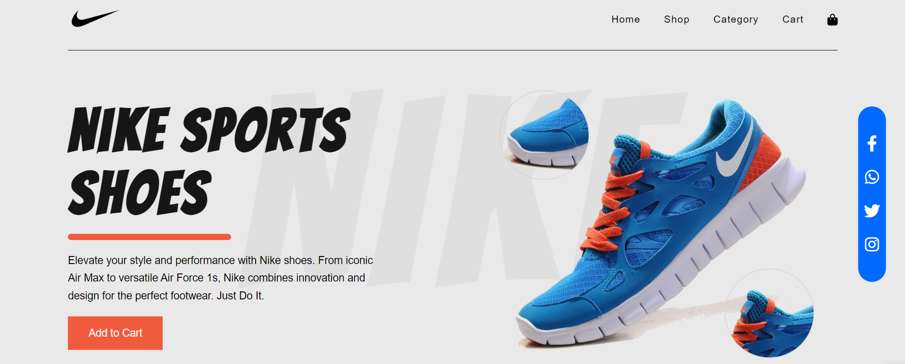

# Nike Landing Page

Welcome to the Nike Landing Page project! This repository contains the code for a captivating landing page designed to showcase Nike's latest sports shoe collection. Whether you're a fan of running, basketball, or training, this landing page is tailored to captivate visitors and highlight Nike's commitment to innovation, performance, and style.

## Features:

- **Sleek Design**: The landing page boasts a modern and sleek design that aligns with Nike's brand identity, featuring clean layouts, bold typography, and vibrant imagery.
  
- **Engaging Animations**: Experience subtle yet impactful animations throughout the page, enhancing user engagement and creating a dynamic browsing experience.

## Technologies Used:

- **HTML5**: Structured the content of the landing page using HTML5 to ensure semantic markup and accessibility.

- **CSS3**: Styled and formatted the page layout with CSS3, leveraging modern techniques such as flexbox and animations for visual enhancements.

## Getting Started:

To explore the Nike Landing Page, simply clone this repository to your local machine and open the `index.html` file in your preferred web browser.

## Contributing:

Contributions to the project are welcome! If you have any suggestions for improvements, bug fixes, or new features, please feel free to open an issue or submit a pull request.

## Project Review:

